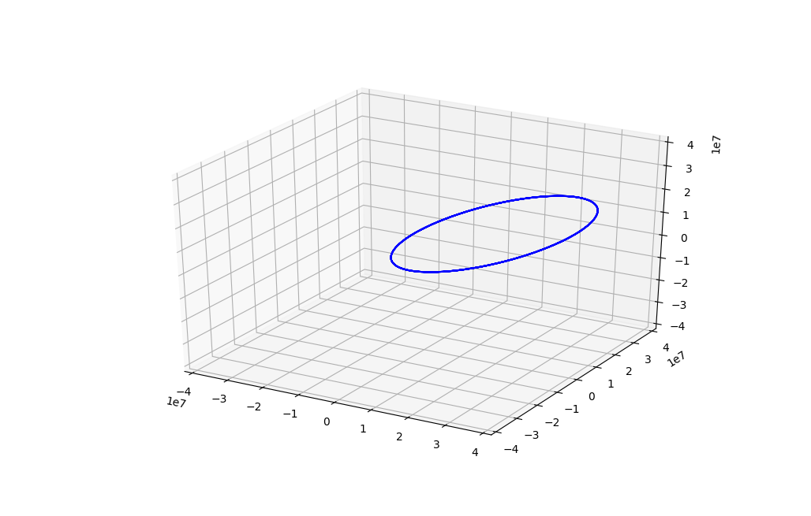

This is my example script
=========================

Docstring for this example

.. literalinclude:: ../../../examples/least_sq_posterior.py
   :language: python
   :linenos:

Outputs
--------

.. code-block:: bash

    PropagatorOrekit instance @ -9223363265289739155:
    -------------------------
    Integrator          : DormandPrince853
    Minimum step        : 0.001 s
    Maximum step        : 120.0 s
    Position Tolerance  : 10.0 m

    Input frame         : ITRF
    Output frame        : EME
    Gravity model       : HolmesFeatherstone
                         - Harmonic expansion order (10, 10)
    Atmosphere model    : DTM2000
    Solar model         : Marshall
    Constants           : WGS84
    Included forces:
     - radiation pressure
     - drag force
     - earth gravity
     - perturbation Moon
     - perturbation Sun
    Third body perturbations:
     - Moon
     - Sun

